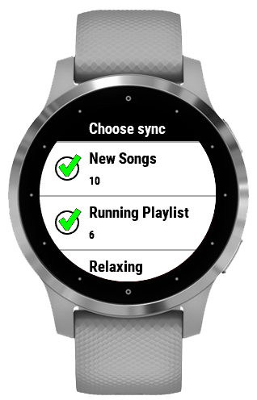
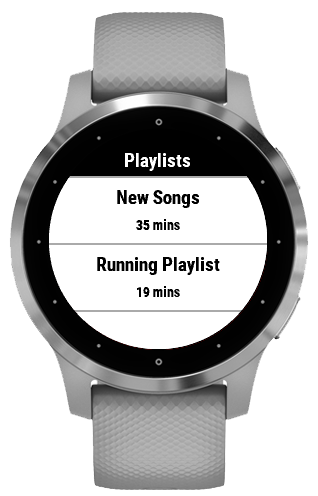
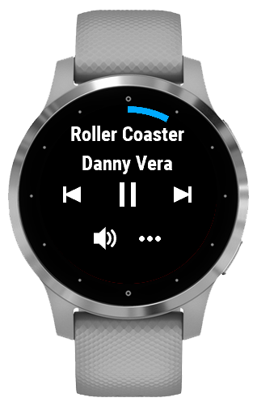
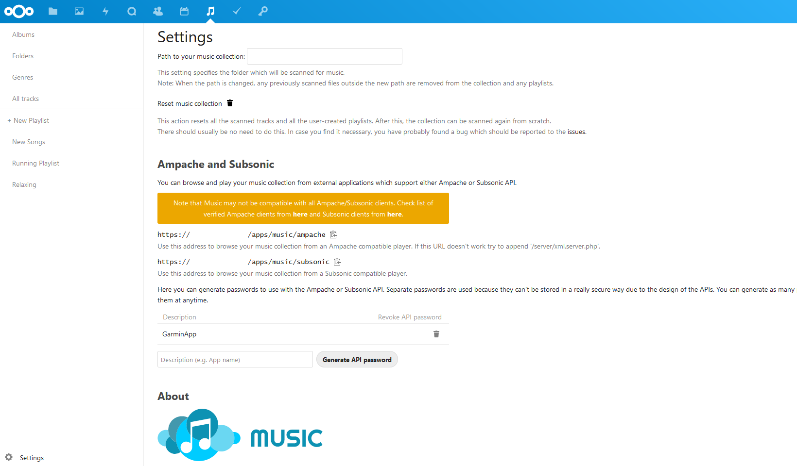

# SubMusic
Synchronize playlists from your own music server: Nextcloud - Subsonic - Ampache - Airsonic.

## How to use

Set up Synced Playlists    |  Choose from synced playlists | Enjoy your music 
:-------------------------:|:-------------------------:|:-------------------------:
 |  | 

## How to set up
You need a music server supporting either the AmpacheAPI or the Subsonic API.

### == Nextcloud ==

In the connect iq app settings, choose 'Ampache API' for the 'API backend' option. Install, enable and open the owncloud/music app. In Settings copy the URL for the Ampache endpoint and paste it into the connect iq app settings. The URL should look like the following: "https://example.nextcloud.com/apps/music/ampache", no trailing slash. Now enter a Description (e.g. "Garmin SubMusic") and Generate API password to enable a new access for the Ampache API endpoint. Enter your username and the generated password in the connect iq app settings.

Only mp3 is supported, since the music app does not transcode music.

### == Ampache ==

Requires the more recent JSON methods in order to work with the watch. Only tested on Nextcloud music app, so please report any issues! Alternatively you can enable the SubSonic backend in System settings in the web UI and select Subsonic API in the connect iq app settings. Note that there are limitations on using Subsonic as endpoint.

### == Subsonic ==

Should be supported now. Please report any issues!

## Known issues 
Below a list of known 'issues'. These are problems that cannot be fixed by design of either the watch software or the API backends chosen.

**SubSonic API** - synchronization of large playlists (above ~25 depending on metadata) is not supported, due to how the Subsonic API is designed and how the watch works. Remove some songs from the playlist if you receive the -402 error during sync.

**General** - self-signed certificates are not supported by the watch (Sync Error: 0). Either use http or proper https certificates.

## == Support ==

If you use the "Contact Developer" option, please make sure to attach your email address to the message so I can reply. You can also go to https://github.com/memen45/SubMusic on GitHub and open an issue.
